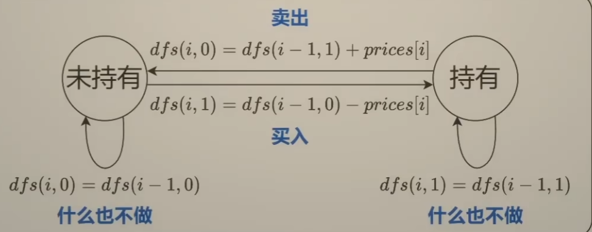

- #状态机 #DP #动态规划
- [122. 买卖股票的最佳时机 II](https://leetcode.cn/problems/best-time-to-buy-and-sell-stock-ii/description/) 不限制交易次数 `prices=[7,1,5,3,6,4]`
- 思路：从最后一天倒着思考
	- 第0天开始到第5天结束时的利润 = 第0天开始到底4天结束时的利润 + 第5天的利润
	- 第5天的利润
		- 什么都不做= 0
		- 买入股票 -4
		- 卖出股票 4
	- 定义状态和状态转移
		- 状态：持有、未持有
		- 转移操作：买入、卖出、什么也不做
		- 
		- dfs(i,0) 表示到第i天结束时，未持有股票的最大利润 。第i天结束是未持有状态，则有两个途径可抵达
			- 第i-1天卖出，同时获得利润prices[i]
			- 第i-1天什么也不做
		- dfs(i,0) 表示到第i天结束时，持有股票的最大利润。第i天结束是持有状态，则有两个途径可抵达
			- 第i-1天什么也不做
			- 第i-1天买入，同时获得利润-prices[i]
		- 
	- 递归边界
		- dfs(-1,0) = 0 第0天开始未持有股票，利润为0
		- dfs(-1,1) = 负无穷 状态不合法，第0天开始不可能持有股票
	- 递归入口
		- 最后一天一定要把股票卖出，才有价值。dfs(n-1,0) >> dfs(n-1,1)
- 条件1：含有冷冻期。卖出后不能买入，需至少相隔1天
	- 买入时，直接从i-2的转移过来即可