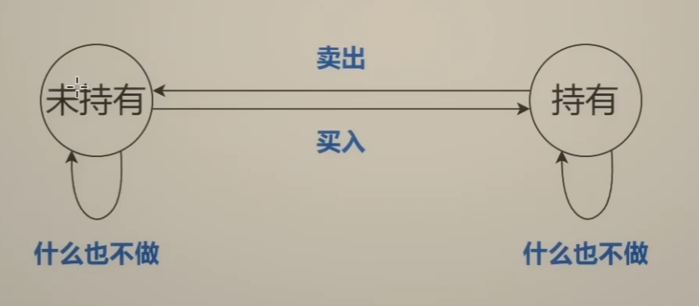

- #状态机 #DP #动态规划
- [122. 买卖股票的最佳时机 II](https://leetcode.cn/problems/best-time-to-buy-and-sell-stock-ii/description/) 不限制交易次数 `prices=[7,1,5,3,6,4]`
- 思路：从最后一天倒着思考
	- 第0天开始到第5天结束时的利润 = 第0天开始到底4天结束时的利润 + 第5天的利润
	- 第5天的利润
		- 什么都不做= 0
		- 买入股票 -4
		- 卖出股票 4
	- 定义状态和状态转移
		- 状态：持有、未持有
		- 转移操作：买入、卖出、什么也不做
		- 
	- dfs(i,0) 表示到第i天结束时，未持有股票的最大利润 。第i天结束是未持有状态，则有两个途径可抵达
		- 第i-1天卖出，同时获得利润prices[i]
		- 第i-1天什么也不做
	- dfs(i,0) 表示到第i天结束时，持有股票的最大利润。第i天结束是持有状态，则有两个途径可抵达
		- 第i-1天什么也不做
		- 第i-1天买入，同时获得利润-prices[i]
	- 
	-