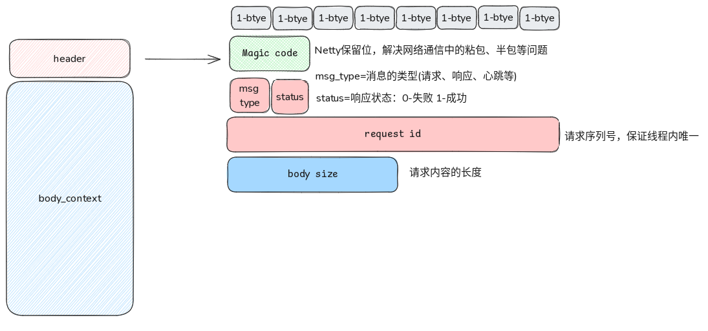

- 参考资料开源代码库 [Jupiter](https://github.com/fengjiachun/Jupiter.git )
- 定义通信协议
	- 
	- ```java
	  private void doEncodeRequest(RequestPayload request, ByteBuf out) {
	          byte sign = StarGateProtocolHeader.toSign(request.serializerCode(), StarGateProtocolHeader.REQUEST);
	          long invokeId = request.invokeId();
	          byte[] bytes = request.bytes();
	          int length = bytes.length;
	  
	          out.writeShort(StarGateProtocolHeader.Head)  //写入两个字节
	                  .writeByte(sign)              //写入1个字节
	                  .writeByte(0x00)            //写入1个字节
	                  .writeLong(invokeId)          //写入8个节节
	                  .writeInt(length)             //写入4个字节
	                  .writeBytes(bytes);
	      }
	  ```
- 客户端调用
	- *客户端通过代理工厂 实现接口的一个代理实例*
		- ```java
		  
		  //客户端通过代理工厂实现接口的一个代理实例
		  IShoppingCartService serviceProxy = ProxyFactory.factory(IShoppingCartService.class)                
		                  .setSerializerType(SerializerType.JDK) //客户端设置所使用的序列化工具，此处为JDK原生
		                  .newProxyInstance(); //返回代理 实现
		  
		  //像调用本地方法一样，调用此代理实例的shopping 方法
		  ShoppingCart result = serviceProxy.shopping("userPin");
		  log.info("result={}", JSONObject.toJSONString(result));
		  ```
	- 动态代理，使用**ByteBuddy**库，生成字节码
	  collapsed:: true
		- ```java
		  
		  //方法newProxy 的具体实现
		  public <T> T newProxy(Class<T> interfaceType, Object handler) {
		              Class<? extends T> cls = new ByteBuddy()
		                       //生成接口的子类
		                      .subclass(interfaceType) 
		                       //默认代理接口中所有声明的方法
		                      .method(ElementMatchers.isDeclaredBy(interfaceType))
		                       //代码增强，即接口中所有被代理的方法都
		                       //委托给用户自定义的handler处理，这也是动态代理的意义所在
		                     .intercept(MethodDelegation.to(handler, "handlerInstance"))
		                      .make()
		                       //通过类加载器加载
		                     .load(interfaceType.getClassLoader(), ClassLoadingStrategy.Default.INJECTION)
		                      .getLoaded();
		  
		              try {
		                  //通过newInstance构建一个代理实例并返回    
		                 return cls.newInstance();
		              } catch (Throwable t) {
		                  ……
		              }
		          }
		  ```
	- 实际调用，也就是代理中的handler
		- ```java
		  public class SyncCaller extends AbstractCaller {
		      //……省略   
		      /**
		       * @RuntimeType 的作用提示ByteBuddy根据被拦截方法的实际类型，对此拦截器的返回值进行类型转换
		       */
		      @RuntimeType
		      public Object syncCall(@Origin Method method, @AllArguments @RuntimeType Object[] args) throws Throwable {
		          //封装请求的接口中的方法名及方法参数，组成一个request请求对象
		          StarGateRequest request = createRequest(methodName, args);
		          //集群容错策略调度器接口
		          //提供快速失败，失败转移等策略供调用方选择，此处默认采用了快速失败的策略
		          Invoker invoker = new FastFailInvoker();
		          //returnType 的类型决定了泛型方法的实际结果类型，用于后续调用结果的类型转换
		          Future<?> future = invoker.invoke(request, method.getReturnType());
		          if (sync) {
		              //同步调用，线程会阻塞在get方法，直到超时或结果可用
		              Object result = future.getResult();
		              return result;
		          } else {
		              return future;
		          }
		      }
		  }
		  
		  //同步，异步调用的关键点就在于InvokeFuture，它继承了Java的CompletionStage类，用于异步编程
		  ```
	- 代理工厂ProxyFactory,将信息组装并生成一个代理实例
	  collapsed:: true
		- ```java
		  public class ProxyFactory<I> {
		      //……省略
		      /**
		       * 代理对象
		       *
		       * @return
		       */
		      public I newProxyInstance() {     
		          //服务的元数据信息
		          ServiceData serviceData = new ServiceData(
		                  group, //分组
		                  providerName, //服务名称，一般为接口的class的全限定名称
		                  StringUtils.isNotBlank(version) ? version : "1.0.0" //版本号
		          );
		  
		          //调用器
		          Calller caller = newCaller().timeoutMillis(timeoutMillis);
		          //集群策略，用于实现快速失败或失败转等功能
		          Strategy strategy = StrategyConfigContext.of(strategy, retries);
		          Object handler = null;
		          switch (invokeType) {
		              case "syncCall":
		                  //同步调用handler
		                  handler = new SyncCaller(serviceData, caller);
		                  break;
		              case "asyncCall":
		                  //异步调用handler
		                  handler = new AsyncCaller(client.appName(), serviceData, caller, strategy);
		                  break;
		              default:
		                  throw new RuntimeException("未知类型: " + invokeType);
		          }
		  
		          //返回代理实例
		          return ProxyEnum.getDefault().newProxy(interfaceClass, handler);
		      }
		      //……省略
		  }
		  ```
- 服务端接收
	- 消息解码
	  collapsed:: true
		- ```java
		  @Override
		      protected void decode(ChannelHandlerContext ctx, ByteBuf in, List<Object> out) throws Exception {
		          switch (state()) {
		              case HEAD:
		                  checkMagic(in.readShort());         // HEAD
		                  checkpoint(State.HEAD);
		              case SIGN:
		                  header.sign(in.readByte());         // 消息标志位
		                  checkpoint(State.STATUS);
		              case STATUS:
		                  header.status(in.readByte());       // 状态位
		                  checkpoint(State.ID);
		              case ID:
		                  header.id(in.readLong());           // 消息id
		                  checkpoint(State.BODY_SIZE);
		              case BODY_SIZE:
		                  header.bodySize(in.readInt());      // 消息体长度
		                  checkpoint(State.BODY);
		              case BODY:
		                  switch (header.messageCode()) {
		                      //……省略
		                      case StarGateProtocolHeader.REQUEST: {
		                          //消息体长度信息
		                          int length = checkBodySize(header.bodySize());
		                          byte[] bytes = new byte[length];
		                          //读取指定长度字节
		                          in.readBytes(bytes);
		                          //调用请求
		                          RequestPayload request = new RequestPayload(header.id());
		                          //设置序列化器编码，有效载荷
		                          request.bytes(header.serializerCode(), bytes);
		                          out.add(request);
		                          break;
		                      }
		  
		                      default:
		                          throw new Exception("错误标志位");
		                  }
		                  checkpoint(State.HEAD);
		          }
		      }
		  
		  ```
	- 请求参数反序列化
	  collapsed:: true
		- ```java
		   @Override
		      public void channelRead(ChannelHandlerContext ctx, Object msg) throws Exception {
		          Channel ch = ctx.channel();
		          if (msg instanceof RequestPayload) {       
		              StarGateRequest request = new StarGateRequest((RequestPayload) msg);
		              //约定的反序列化器, 由客户端设置
		              byte code = request.serializerCode();
		              Serializer serializer = SerializerFactory.getSerializer(code);
		              //实际请求参数字组数组
		              byte[] bytes = payload.bytes();
		              //对象反序列化
		              Message message = serializer.readObject(bytes, Message.class);
		              log.info("message={}", JSONObject.toJSONString(message));
		  
		              request.message(message);
		  
		              //业务处理
		              process(message);
		          } else {
		              //引用释放
		              ReferenceCountUtil.release(msg);
		          }
		      }
		  ```
	- 通过反射,处理客户端请求
	  collapsed:: true
		- ```java
		  public void process(Message message) {         
		     try {
		         ServiceMetadata metadata = msg.getMetadata(); //客户端请求的元数据
		         String providerName = metadata.getProviderName(); //服务名，即接口类名
		  
		         //根据接口类名，查找服务端实现此接口的类的全限定类名
		         providerName = findServiceImpl(providerName);
		         String methodName = msg.getMethodName();  //方法名
		         Object[] args = msg.getArgs();    //客户设置的实际参数
		  
		         //线程上下文类加载器
		         ClassLoader classLoader = Thread.currentThread().getContextClassLoader();
		         //加载具体实现类
		         Class<?> clazz = classLoader.loadClass(providerName);
		         //创建接口类实例
		         Object instance = clazz.getDeclaredConstructor().newInstance();
		  
		         Method method = null;
		         Class<?>[] parameterTypes = new Class[args.length];
		         for (int i = 0; i < args.length; i++) {
		             parameterTypes[i] = args[i].getClass();
		         }
		         method = clazz.getMethod(methodName, parameterTypes);
		  
		         //反射调用 
		         Object invokeResult = method.invoke(instance, args);
		         } catch (Exception e) {
		              log.error("调用异常：", e);
		             throw new RuntimeException(e);
		         }
		  
		         //处理同步调用结果
		        doProcess(invokeResult);
		  
		  }
		  ```
	- 回复请求
	  collapsed:: true
		- ```java
		  
		  //处理同步调用结果,并将结果写回到 Netty channel
		  private void doProcess(Object realResult) {
		          ResultWrapper result = new ResultWrapper();
		          result.setResult(realResult);
		          byte code = request.serializerCode();
		          Serializer serializer = SerializerFactory.getSerializer(code);
		          //new response 响应消息对象
		          Response response = new Response(request.invokeId());
		          //调用结果序列成字节数组
		          byte[] bytes = serializer.writeObject(result);
		          response.bytes(code, bytes);
		          response.status(Status.OK.value());
		  
		          //响应消息对象 response 写入 Netty channel
		          channel.writeAndFlush(response).addListener(new ChannelFutureListener() {
		              @Override
		              public void operationComplete(ChannelFuture channelFuture) throws Exception {
		                  if (channelFuture.isSuccess()) {
		                      log.info("响应成功");
		                  } else {
		                      //记录调用失败日志
		                      log.error("响应失败, channel: {}, cause: {}.", channel, channelFuture.cause());
		                  }
		              }
		          });
		      }
		  ```
- 客户端接受
	- 反序列化并匹配请求
	  collapsed:: true
		- ```java
		  @Override
		      public void channelRead(ChannelHandlerContext ctx, Object msg) throws Exception {
		          Channel ch = ctx.channel();
		          if (msg instanceof ResponseMessage) {
		              try {
		                  //类型转换
		                  ResponseMessage responseMessage= (ResponseMessage)msg
		                  StarGateResponse response = new StarGateResponse(ResponseMessage.getMsg());
		                  byte code = response.serializerCode();
		                  Serializer serializer = SerializerFactory.getSerializer(code);
		                  byte[] bytes = responseMessage.bytes();
		                  //反序列化成调用结果的包装类
		                  Result result = serializer.readObject(bytes, Result.class);
		                  response.result(result);
		  
		                  //处理调用结果
		                  long invokeId = response.id();
		                  //通过 rnvokeid,从地缓存中拿到客户端调用的结果点位对象 futrue
		                  DefaultFuture<?> future = FUTURES_MAP.remove(invokeId);
		  
		                  //判断调用是否成功
		                  byte status = response.status();
		                  if (status == Status.OK.value()) {
		                      //对调用结果进行强制类型转换，并设置future结果，对阻塞在future.get()的客户端同步调用来说，调用返回。
		                      complete((V) response.getResult());
		                  } else {
		                      //todo 处理异常
		                  }
		  
		              } catch (Throwable t) {
		                  log.error("调用记录: {}, on {} #channelRead().", t, ch);
		              }
		          } else {
		              log.warn("消息类型不匹配: {}, channel: {}.", msg.getClass(), ch);
		              //计数器减1
		              ReferenceCountUtil.release(msg);
		          }
		      }
		  ```