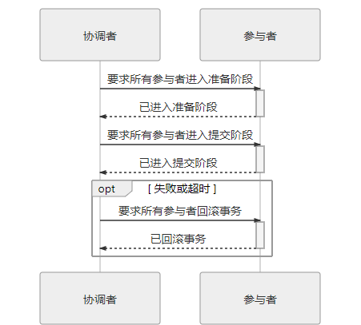
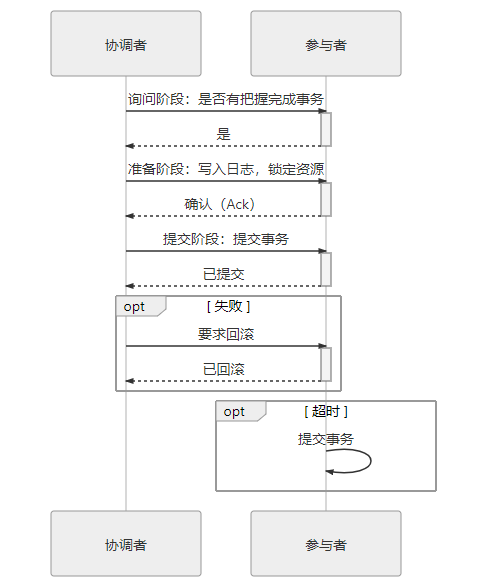
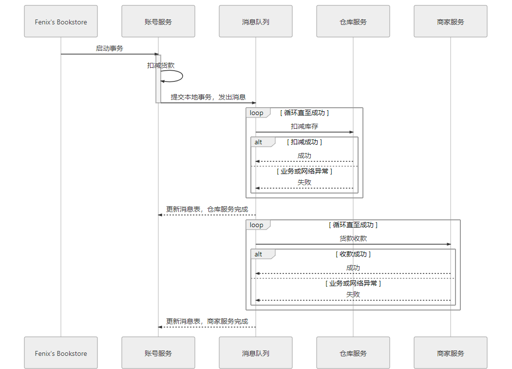

- [[分布式事务面试题]]
- 事务存在的意义是为了保证系统中所有的书籍都是符合预期的，且不会产生矛盾。即数据的 **一致性**。 而要达成这个目标，就需要三方面的共同努力
	- 原子性：对多个数据的修改，要么同时成功，要么同时被撤销。
	- 隔离性：各自业务正在读、写的数据互相独立，不会彼此影响。
	- 持久性：所有成功被提交的数据修改都能够正确地被持久化，不丢失数据。
- 本地事务
	- 仅操作单一事务资源的、不需要全局事务管理器进行协调的事务。简单来说，就是 单个服务使用单个数据源。
	- 它的实现方式通常依赖于底层的 数据引擎，如MySQL中的InnoDB。
	- 通过双写日志的形式，保证原子性和持久性
	- 通过MVCC机制和锁机制 保证隔离性
- 全局事务
	- 单个服务使用多个数据源场景。
	- 存在的问题 ```
	  public void buyBook(PaymentBill bill) {
	      userTransaction.begin();
	      warehouseTransaction.begin();
	      businessTransaction.begin();
	  	try {
	          userAccountService.pay(bill.getMoney());
	          warehouseService.deliver(bill.getItems());
	          businessAccountService.receipt(bill.getMoney());
	          userTransaction.commit(); //1
	          warehouseTransaction.commit(); //2
	          businessTransaction.commit(); //3
	  	} catch(Exception e) {
	          userTransaction.rollback(); //1
	          warehouseTransaction.rollback(); //2
	          businessTransaction.rollback(); //3
	  	}
	  }
	  ```
	- 事务3提交失败，将会执行到catch代码块，可此时事务1,2均已成功提交，即使执行了rollback()方法也无济于事。
	- 为解决上述问题，**XA**协议将事务提交拆分为两阶段过程，因此也称为”两段式提交“ **2PC**.
		- 
		- **准备阶段**: 协调者询问事务的所有参与者是否准备好提交,参与者可以回复 Prepared 和 Non-Prepared. 它与本地事务中真正提交的区别只是**暂不写入最后一条 Commit Record** 而已
		- **提交阶段**: 协调者如果在上一阶段收到所有事务参与者回复的 Prepared 消息，则先自己在本地持久化事务状态为 Commit，在此操作完成后向所有参与者发送 Commit 指令，所有参与者立即执行提交操作；**否则**，任意一个参与者回复了 Non-Prepared 消息，或任意一个参与者超时未回复，协调者将自己的事务状态持久化为 Abort 之后，向所有参与者发送 Abort 指令，参与者立即执行回滚操作。
		- 对于数据库来说，提交操作仅仅只有一条指令，通常能够快速完成。而回滚操作则需要清除已提交的数据，相对耗时。
		- 协调者、参与者都是可以由数据库自己来扮演的，而app相对于数据库来说只是client角色。协调者一般是在参与者之间**选举**产生。
		-
	- 两段式提交原理简单，并不难实现，但有几个非常显著的**缺点**：
		- **单点问题**：协调者等待参与者回复时可以有超时机制，允许参与者宕机协调者本身宕机而一直没有恢复，所有参与者都会受到影响。
		- **性能问题**：需要要经过两次远程服务调用，三次数据持久化。注定了性能较差。
		- **一致性风险**：两段式提交的成立是有前提条件的，当**网络稳定性**和**宕机恢复能力**的假设不成立时，仍可能出现一致性问题。
	- 为了缓解两段式提交协议中的单点问题，在2PC之上发展出了”三段式提交“ **3PC**
		- 
		- 如果在 准备阶段(PreCommit)之后发生了协调者宕机,默认的操作策略将是提交事务。
		- 新增一轮询问阶段(CanCommit)，使得事务能够成功提交的把握就增大。
		- 但在正常的提交场景中，多了一次询问，比2PC的性能更差。
		- 而且对一致性风险问题并未有任何改进。
- 分布式事务
	- **CAP**理论指出，一个分布式系统中，涉及共享数据问题时，**一致性**(Consitency)、**可用性**(Availability)和**分区容错性**(Partition Tolerance)三者只能同时满足其二。
	- 看似有得选择，然而在现实世界中，几乎不可能放弃分区容错性P,因此，只能在一致性和可用性中取舍。
		- HBase就是追求强可用性的代表，假如某个 RegionServer 宕机了，这个 RegionServer 持有的所有键值范围都将离线，直到数据恢复过程完成为止。
		- 大部分系统级应用，为了保证最终交付的时候是正确的，都在保求可用性而放弃了一致性。转而追求 最终一致性。
		- 最终一致性指的是：如果数据在一段时间之内没有被另外的操作所更改，那它最终将会达到与强一致性过程相同的结果。
	- **BASE**理论，是一种独立于ACID之外的，达成最终一致性目的的有效途径。通过引入一个”可靠事件队列“，来不断尝试调用接口，直到成功。
		- 
	-
-