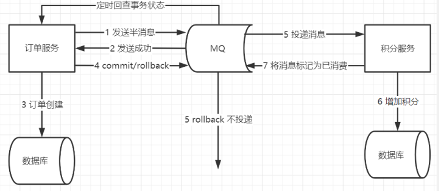
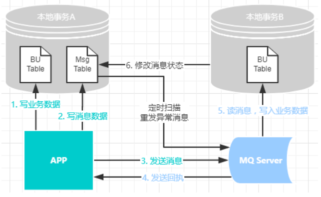

- {{cards 分布式事务面试题}}
	- Summary: 4 items, 4 review counts [[2023年08月02日]]
		- Remembered:   4 (100%)
		- Forgotten :   0 (0%)
- 分布式事务了解吗？ #card
  card-last-interval:: 4
  card-repeats:: 2
  card-ease-factor:: 2.22
  card-next-schedule:: 2023-08-20T08:03:21.050Z
  card-last-reviewed:: 2023-08-16T08:03:21.051Z
  card-last-score:: 3
	- 2PC方案
		- 准备阶段 {{cloze 协调者询问事务的所有参与者是否准备好提交}} 本质就是 {{cloze 暂不写入最后一条Commit Record }}
		- 提交阶段 先自己在本地持久化事务状态为 {{cloze Commit}} ，在此操作完成后向所有参与者发送 {{cloze Commit}} 指令，所有参与者立即执行提交操作;否则，发送 {{cloze Abort}} 指令
	- 可靠消息队列(BASE)方案
		- 基于MQ的 {{cloze 半消息机制}}
			- 
			- 事务发起方首先发送 {{cloze 半消息}} 到MQ，成功后再执行 {{cloze 本地事务}} 。
			- 本地事务失败， {{cloze MQ将丢弃该消息不投递}} ；本地事务成功， {{cloze MQ将会消息发送给消息订阅方}} ；
			- {{cloze 订阅方}} 根据消息执行本地事务，直到 {{cloze 消费成功}} ，将消息标记为已消费
		- 基于本地消息表
			- 
			- 事务发起方，利用本地事务，将业务数据和事务消息直接写入数据库。
			- 发送MQ消息，并记录状态，如果发送失败，进行重试
			- 消费方进行事务处理，并修改记录状态
			- 如果在业务层面失败，给消息生产方发送业务补偿消息，通知进行回滚等操作
	- TCC方案
		- Try 对资源进行 {{cloze 检查}} 和 {{cloze 预留}}
		- Confirm 在各个服务中 {{cloze 执行实际操作，消耗预留的资源}}
		- Cancle {{cloze 执行回滚操作，退还预留资源}}
	- SAGA方案
		- 将一个大事务 {{cloze 拆解成T1..Tn的多个}} 小事务
		- 每个本地事务都有对应的 {{cloze 补偿操作Ci}}
		- 当事务Ti执行失败时，有两种策略
			- 正向恢复：重试Ti及之后的Ti+1 ...Tn,最终 {{cloze 都要成功}}
			- 反向恢复：进行 {{cloze 失败补偿}} ，执行**Ci**,Ci-1...C2,C1.
	-
- 什么是CAP理论 #card
  card-last-interval:: 4
  card-repeats:: 2
  card-ease-factor:: 2.22
  card-next-schedule:: 2023-08-20T08:02:12.789Z
  card-last-reviewed:: 2023-08-16T08:02:12.789Z
  card-last-score:: 3
	- 一致性 C
		- 对系统的一个数据更新成功之后，如果所有用户都能够读取到最新的值
	- 可用性 A
		- 分布式系统中，提供可用服务的时间占总体时间的4个9 99.99%
	- 分区容错性 P
		- 在遇到任何网络故障的时候，仍然需要能对外提供一致和可靠的服务
	- 分布式系统所追求的就是 {{cloze 分区容错性}}，因此只剩下 {{cloze 可用性}} 和 {{cloze 一致性}} 的取舍
		- 实现了一致性的系统 {{cloze HBase}} {{cloze ZK}}
		- 实现了可用性的系统 {{cloze Eureka}} {{cloze Redis}}
	-
- 什么是BASE理论 #card
  card-last-interval:: 4
  card-repeats:: 2
  card-ease-factor:: 2.22
  card-next-schedule:: 2023-08-20T08:00:57.536Z
  card-last-reviewed:: 2023-08-16T08:00:57.537Z
  card-last-score:: 3
	- 基本可用 Basically Available
		- 系统在出现故障的时候，保证 {{cloze 核心}} 可用，允许损失部分可用性。
	- 软状态 Soft State
		- 允许系统中的数据 {{cloze 存在中间状态}} ，并认为该中间状态不会影响系统整体可用性。即允许数据在 {{cloze 同步过程}} 中存在 {{cloze 延迟}}
	- 最终一致性 Eventually Consistent
		- 系统中所有的数据副本，在经过一段时间的同步后， {{cloze 最终能达到一致的状态}} 。
- 请根据具体业务场景分析出应当采用何种分布式事务方案 #card
  card-last-interval:: 4
  card-repeats:: 2
  card-ease-factor:: 2.22
  card-next-schedule:: 2023-08-20T08:00:28.078Z
  card-last-reviewed:: 2023-08-16T08:00:28.078Z
  card-last-score:: 3
	- 强一致性场景 用于 {{cloze 吞吐量不高}}的情况 {{cloze 2PC及其实现 Seata AT模式}}
	- 弱一致性场景 用于 {{cloze 核心模块，如交易\订单}} {{cloze Seata TCC模式}}
	- 最终一致性场景 用于 {{cloze 边缘模块 如库存}} {{cloze 可靠消息队列方案}}
-