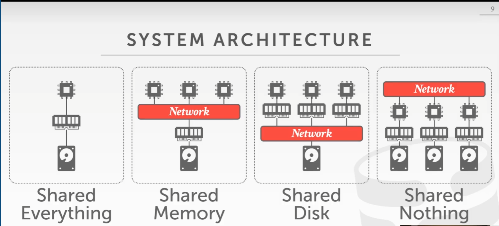

- 并行 Parallel VS. 分布式 Distributed
	- 并行数据库
		- 节点在物理上十分靠近
		- 节点之间依靠告诉LAN网络连接
		- 通信的cost非常小
	- 分布式数据库
		- 节点之前可以隔得非常远
		- 节点的连接依靠公共网络
		- 通信cost会是一项值得注意的问题
- 系统架构 System Architectures
	- DBMS的系统架构是指 CPU如何访问那些共享的资源
	- 这受到CPU的任务调度时机 和 objects的重试/存储有关
	- {:height 193, :width 386}
		- 共享内存型
		  collapsed:: true
			- 多个CPU共享同一块内存空间，使得他们能够迅速互联
				- 对于存储在内存中的数据结构，每一个进程都有全局视野
				- 每一个DBMS中的进程实例，都“知晓”彼此的存在
		- 共享磁盘型
		  collapsed:: true
			- 多个CPU共享一个本地磁盘，他们之间也能够迅速互联，但每个进程有自己的内存空间。
				- 可以独立于存储层，扩展执行层。
				- 必须通过发送消息才能知晓他们之间的状态
			- 每一组CPU+内存构成一块 能够单独工作的节点Node，可以任意的scale Node
			- update数据时，需要worker node主动push更新，通知其他Node
		- 什么都不共享
		  collapsed:: true
			- 每一个DBMS实例都有自己的完整一套CPU、内存和磁盘
			- Node之间的通信只能依靠network
				- 难于横向扩充
				- 难于确保一致性
				- 更高的性能和效率
- 设计要点 Design Issues
	- app应该怎么找到想要的数据？
	- 在数据分散的情况下如何执行查询？
		- push 查询向数据靠近
		- pull 数据拉取到执行查询的机器上
	- DBMS如何保证一致性？
	- ((6692263d-0073-4905-b7be-8b721dc2d06e))
	- ((6692353f-5696-43ce-bdd4-2af6900d4d19))
	-
- Schema分区 Partition Schemes
- 分布式并行协议 Distributed Concurrency Control
- ---
- 同构集群 Homogeneous VS. 异构集群 Heterogeneous
  id:: 6692263d-0073-4905-b7be-8b721dc2d06e
	- 同构集群
		- 集群中的每一个节点都可以执行相似的一组任务(尽管数据可能在不同的分区上)、
		- 更容易的资源调配和故障转移
	- 异构集群
		- 节点执行的是不同的任务（有角色的区分，每个角色运行特定的任务）
		- 可以允许一个物理节点分成多个“虚拟”节点来专心致志的工作
- Data Transparency 数据透明度
  id:: 6692353f-5696-43ce-bdd4-2af6900d4d19
	- 使用者不应该去了解数据存储的具体物理位置，如何分区和分片。
	- 一条SQL如果在单机DBMS上能够成功运行，那么在分布式DBMS上也应该得到一致的结果
- 数据库分区 Database Partitioning
	- 对多种资源的拆分
		- 磁盘、node、进程
		- 有时又被称作“共享”
	- DBMS在每一个partition上执行的是本次查询的一个片段fragment，然后聚合他们的结果