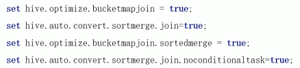

- [[分桶表]]设计思想 --  通过一个分桶函数，将数据划分成多个文件进行存储。
- 如果两张分桶表按相同的规则划分，则在Join时就可以实现Bucket与Bucket的join，避免不必要的比较，减少 [[笛卡尔积]] 的数量。
  id:: 621b234c-c98d-4745-b485-bee7d9a2f7ac
	- 相同规则条件： Join关联的字段相同；使用的分桶函数相同。
- 分桶表的实际使用
	- 开启Bucket join
	  ```SQL
	  set hive.optimize.bucketmapjoin = true;
	  set hive.auto.covert.sortmerge.join = true;
	  set hive.optimize.bucketmapjoin.sortemerge = true;
	  ```
	- 实际使用中，相同规则条件 这一条件苛刻，很难达成。只能在精心设计下的少量几张表之间使用，才能达到效果。因此一般不采用分桶优化。但是开启分桶，能够一定程度的减少小文件的诞生，也是起到了一定的优化作用的。
- 两种 Bucket Join
  id:: af068531-83f5-4711-9ab6-619396eda1c6
	- clustered by col_name
		- `set hive.optimize.bucketmapjoin = true`
		- 分桶字段 = Join字段，桶的格式相等或成倍数
	- clustered by col_name sorted by (col_name)
		- 
		- 分桶字段 = Join字段 = 排序字段，桶的格式相等或成倍数