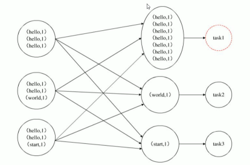

- 现象是：当一个程序运行时，它的大多数task都已经结束了，只有某一个task一直在运行，迟迟不能结束，导致整体进度卡在99%
- 原因 数据分配不均匀
	- 
	- 具有产生原因-- Group by 、Count(distinct)
		- 解决方案一： 开启Map端聚合
			- `hive.map.aggr = true;` 通过减少shuffle数量和reducer阶段的执行时间，避免每个Task数据差异过大导致数据倾斜
		- 解决方案二：实现随机分区
			- `select * from table distribute by rand();` 通过rank()随机函数+distribute by 指定分区。实现随机分区，避免因分区函数而引起的数据倾斜。
		- 解决方案三：倾斜时自动负载均衡
			- `hive.groupby.skewindata = true` ,会开启两个 [[MapReduce]]
				- 第一个 [[MapReduce]] 自动进行随机分布到Reducer中，每个Reducer做部分聚合操作，输出结果
				- 第二个 [[MapReduce]] 将上一步聚合的结果再按照业务(group by key) 进行处理，保证相同的分布到一起，最终聚合得到的结果
	- 产生原因-- Join
		- 解决的核心思想是尽量使用Map Join ，少用Reduce Join
		- 方案一：提前过滤，将大数据变成小数据，实现Map Join
		- 方案二：