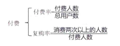

- 理解数据的两步骤
	- 每一列的含义 (数据字典)
	- 对数据进行分类
		- 用户数据(我是谁)
			- 姓名\性别\年龄 等
		- 行为数据(我做了什么)
			- 浏览页面\购买产品
		- 产品数据(业务贩卖什么)
			- 淘宝的商品\抖音的视频\公众号上的文章
- 常用指标
  collapsed:: true
	- 新增用户数 #用户指标
		- 可以进一步按 **渠道来源** 拆解
	- 用户活跃率 #用户指标
		- 需要有一个明确的**活跃定义**
	- 用户留存率 #用户指标
		- 
		- 4-2-1法则: 次日留存40%,7日留存20%,30日留存10. 该产品的表现是较好的.
	- 页面访问**次数** PV(Page View) #行为指标
		- 一定时间内某个页面的浏览次数
	- 页面访问**人数** UV(Unique Visitor) #行为指标
		- 一定时间内访问某个页面的人数
	- 转发率 #行为指标
		- 
	- 转化率 #行为指标
		- 
	- K因子 (k-factor) #行为指标
		- 用来衡量推荐效果,一个发起推荐的用户可以带来多少新用户.
		- `平均每个用户向多少人发出邀请 * 接收到邀请的人转化为新用户的转化率`
		- 驱动设计者向产品中加入 自传播(病毒式营销) 的功能
	- 总量 #产品指标
		- 
	- 人均 #产品指标
		- 
	- 付费 #产品指标
		- 
	- TOPN榜单 #产品指标
		- 按某个指标进行排序
	-
		-
- 如何选择指标
	- 多用比例型的指标
	- 根据业务重点,找到核心指标
- 建立指标体系
	- 指标用于衡量业务的健康程度 和 评判业务发展
	- 制定指标
		- 明确部门KPI,找到一级指标
		- 了解业务运营情况, 找到二级指标
		- 梳理业务流程,找到三级指标
	- 指标体系落地
		- 需求分析,针对某一业务模块\业务发展方向
		- 制定指标
		- 设计展现形式
		- 编写文档
		- 报表开发
	- 指标常见问题
		- 没有一级指标,抓不住重点
		- 指标之间没有逻辑关系
		- 拆解的指标没有业务意义
		- 不和多方协同沟通,一个人单干
- 常见分析方法
	- 5W2H
		- what 是什么,对xxx的定义
		- when 何时,什么时间段
		- where 何地,什么场景
		- why 为什么,为什么需要\选择\使用...
		- who 是谁
		- how 怎么做
		- how much 多少钱
		- 不能用于复杂问题分析,如 销量为什么下降了
	- 逻辑树
		- 将复杂问题拆解为子问题,用于回答[[费米问题]]
		- 通常结合其他方法使用
	- PEST 行业分析
		- 政策 Policy
		- 经济 Economy
		- 社会 Socicty
		- 技术 Technology
	- 多维度拆解
		- 从指标构成(公式)拆解
		- 从业务流程拆解
		- 
	- 对比分析
		- 和谁比
			- 相似\竞品
			- 整个行业
		- 如何比
			- 数据整体大小
			- 数据整体波动
			- 趋势变化
		- 比较对象的规模要一致