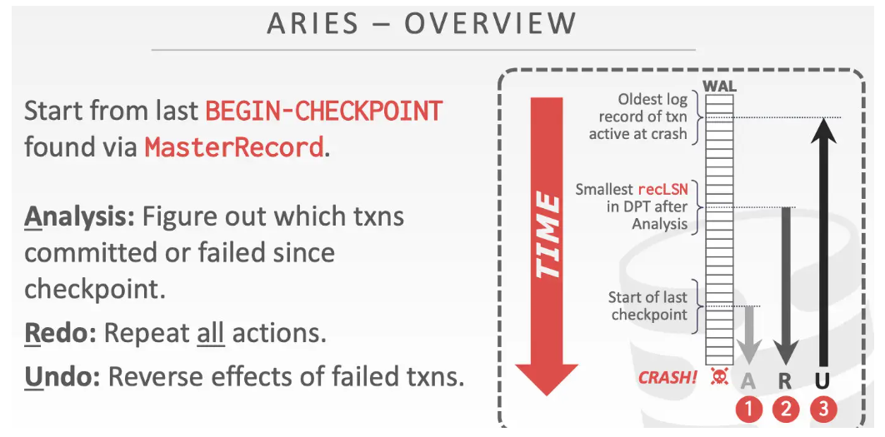
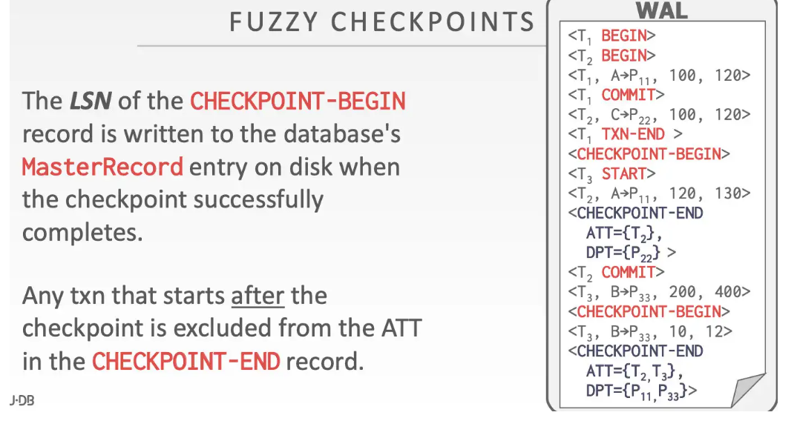
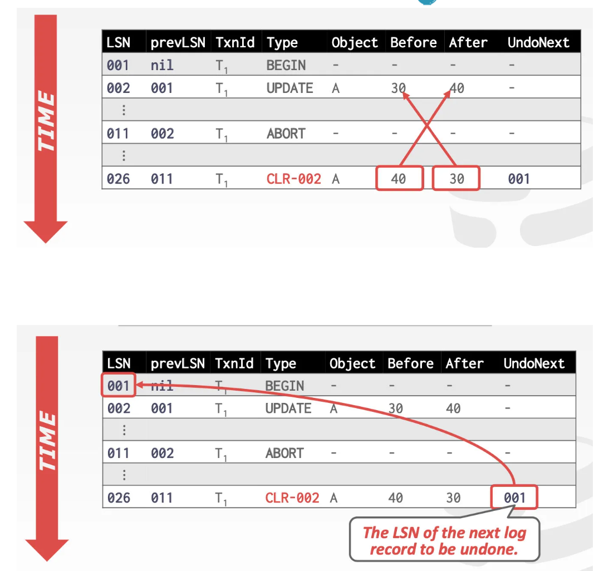

- ARISE算法 数据库恢复 原型算法
	- WAL支撑
		- 日志先于数据落盘
		- Steal + No-Force的缓存池管理策略
	- Redo过程是复现历史操作
		- 按照日志记录的内容做回放，恢复到故障发生前的状态
	- Undo过程是记录变更
		- 在 undo 过程中记录 undo 操作到日志中，确保在恢复期间再次出现故障时不会执行多次相同的 undo 操作
- ARISE算法步骤
  id:: 669e05fa-6ec5-4ce7-8d72-ec8fa277ff80
	- 
	- Analysis 分析
		- 在DBMS宕机重启之后把磁盘上的WAL文件读入缓存，并找到其中的 ((66890cb3-58bc-4faf-a28d-9b40457a5046))，定位到**上一次checkpoint**的存档点，之后分析**它后面的所有日志**，并且结合ATT和DPT中的信息，从而推断出DBMS在宕机时系统的情况，进而决定该undo哪些事务，redo哪些事务
		- ((668901d4-cff9-47ee-8fb0-0d589aecb205))
	- Redo
		- 跳转到事务没有正确落盘的记录的位置，然后开始重新执行到日志末尾的这段操作。
		- 对每一个你能看见的事务都这么做，即使你知道该事务最终是abort的。
		- ((66890241-6e9d-4f01-8a1b-89e9d2b43bdd))
	- Undo
		- undo阶段你需要按照相反的方向执行，从日志末尾直到某个点的这段操作，目的是逆转该事务没有commit的更改。
		- undo阶段完成后，此时的数据库恢复到崩溃之前一刻的状态：没有来自abort事务的部分更新，并且来自commit事务的所有更改都已应用到磁盘。
		- ((66890476-c6ce-4f91-8d24-102933579c8a))
- LSN 日志序列号 Log Sequence Numbers
	- WAL中的每条日志记录都需要包含一个全局唯一且一般是单调递增的ID
	- DBMS中的不同部分都需要记录某些相关的LSN信息(不同种类的LSN)
		- flushedLSN
			- 内存|最后落盘的那个 LSN
		- pageLSN
			- page_x|脏页page_x的最新修改
		- recLSN
		  id:: 66890cad-c93c-417d-a0f2-a6232e375eaf
			- page_x|脏页page_x的第一个修改
		- lastLSN
		  id:: 66890cb0-fd38-47c3-8c3a-8fb3e69229ba
			- 事务T_i|事务T_i留下的最后一条日志
		- MasterRecord
		  id:: 66890cb3-58bc-4faf-a28d-9b40457a5046
			- 磁盘|上一次打checkpoint点 对应的地方
	- 脏页Flush有关的LSN
	  collapsed:: true
		- 被刷新的page都包含pageLSN
		- DBMS会持续追踪flushedLSN
		- 在page_x写入磁盘前，我们必须确保刷入的日志记录至少满足如下条件 `pageLSN_x <= flushedLSN`
			- 比flushedLSN小的pageLSN记录都应该刷入磁盘
			- {:height 415, :width 361}
		- 所有的日志记录都有LSN
		- 一旦事务修改了page中的记录，就要更新相应的pageLSN
		- 每次DBMS将WAL缓冲区写入磁盘，就更新在内存中的flushedLSN
- 事务的提交&回滚操作
	- 前提假设
		- 所有的日志记录都在一个page里面
		- 写入磁盘的操作是原子性的
		- 记录tuples使用的是严格的2PL模式
		- buffer manager使用的是Steal +No-force模式
	- ((6688ef41-9419-49db-90f1-72edc2ed1159))
	- ((6688f069-3102-4273-9ac1-0bb82b9d84a3))
- Fuzzy Checkpointing checkpoint的改进
	- 在上一期的 ((6683dbff-fb83-4564-8575-950ca03880e0)) 中,DBMS将在checkpoint制作期间确保一些事情，为了快照的一致性。
		- 不让任何新的事务开始执行
		- 等待所有活跃的事务finish
		- flush所有的脏页进入磁盘
	- 优化一点的Checkpoints
		- 制作checkpoint时，暂停写入型事务
			- checkpoint开始后阻止事务继续获取数据或索引的写锁 (write latch)
			- 不必等待所有活跃的事务finish之后再制作checkpoint
		- 有些未commit的事务写入的数据可能会被checkpoint线程一起捎带落盘，因此这时磁盘中的数据 snapshot可能处于 inconsistent 的状态.
		- 但是只要我们在 checkpoint 的时候记录哪些活跃事务正在进行，哪些数据页是脏的，故障恢复时读取 WAL 就能知道存在哪些活跃事务的数据可能被部分写出，从而恢复 inconsistent 的数据.
		- 因此，我需要 ((6688f325-fa77-4f78-9e06-e6cac569ccb3)) 和 ((6688fbc1-39d7-43c1-9031-6b602c45d6db))
	- Fuzzy Checkpoints
		- 在做checkpoint的时候，所有的事务都可以正常工作，并且不会强制把所有的脏页都落盘
		- checkpoint阶段会写两条日志:
			- `Checkpoint-begin`: checkpoint阶段的开始
			- `Checkpoint-end`: checkpoint阶段的结束 包含 ((6688f325-fa77-4f78-9e06-e6cac569ccb3)) + ((6688fbc1-39d7-43c1-9031-6b602c45d6db))
		- {:height 322, :width 551}
-
- ---
- Transaction Commit 事务提交
  id:: 6688ef41-9419-49db-90f1-72edc2ed1159
	- 向日志中写入一条`COMMIT`记录
	- 这条`commit`记录之前的所有日志记录，都flush到磁盘
		- flush的过程是连续且同步的写入磁盘
		- 写入的是一张log page中的许多log条目
		- 更新flushedLSN = commit LSN
	- 当此操作成功，再写入一条`TXN-END`记录
		- 这条记录不需要立即flush
	- 整个过程并没有触发 checkpoint制作 或 脏页刷新
- Transaction Abort 事务回滚
  id:: 6688f069-3102-4273-9ac1-0bb82b9d84a3
	- 事务回滚对于ARIES来说是一个特殊的undo操作。
	- 需要在日志记录中增加一个字段:prevLSN
		- prevLSN: 当前事务T1的上一条日志记录
		- 这就构成了一条事务T1的日志记录链表，方便查找事务T1所做的所有操作
	- 在对事务做回滚时，需要把进行过的回滚操作也写入日志，称为 ((6688f321-dd63-4a09-895a-e05a52c45cf0))
		- 防止在回滚过程中再次出现故障，导致部分操作被执行多次
	- 回滚完毕后，再写入一条`TXN-END`记录
- CLR 回滚操作日志 compensation log records
  id:: 6688f321-dd63-4a09-895a-e05a52c45cf0
	- 一条CLR描述的 先前被更新的记录的undo操作，它包含那条update 记录的所有字段，以及一个undoNext指针(指向下一个undo LSN)
		- {:height 343, :width 347}
	- CLR虽然被写入了日志记录里，但DBMS并不需要等待他们都被flush了才通知app”事务abort“
		- 不需要强制落盘
		- 不必等到所有的undo操作都做完并且CLR都落盘，在事务abort的时候可以直接告知用户事务abort了
- Active Transaction Table 活跃事务表 ATT
  id:: 6688f325-fa77-4f78-9e06-e6cac569ccb3
	- 每一个entry代表着当前活跃着的事务
		- txnId: 事务的唯一id
		- status:事务的当前状态
			- R-> running
			- C->comminting
			- U->Candidate for Undo (暂未提交)
		- lastLSN: 最近创建的一条LSN
	- 当`TXN-END`条目写入WAL后，相应的entry将被移除
- Dirty Page Table 脏页表 DPT
  id:: 6688fbc1-39d7-43c1-9031-6b602c45d6db
	- 记录的是缓存池中当前还没落盘的脏页
	- 每一个entry代表一个未落盘的脏页
		- recLSN:  首次导致该page变成脏页的LSN
- 详细的Analysis阶段
  id:: 668901d4-cff9-47ee-8fb0-0d589aecb205
	- 从 ((66890cb3-58bc-4faf-a28d-9b40457a5046))开始，向后扫描记录。如果找到一条`TXN-END`记录，从  ((6688f325-fa77-4f78-9e06-e6cac569ccb3))表中移除相应的事务
	- 其他记录的处理方式
		- 向ATT新增一条对应记录的事务数据，状态是U
		- 读取到了`Commit`记录，改变ATT表中，对应事务的状态为C
	- 对于更新了数据的记录
		- if page_P not in ((6688fbc1-39d7-43c1-9031-6b602c45d6db)) ，add p to DPT, set `page_p.recLSN= currItem.LSN`
	- 最终
		- ATT表中的记录就是 崩溃时刻正在活跃的所有事务
		- DPT表中的记录就是 还没有刷入磁盘的脏页
- 详细的Redo阶段
  id:: 66890241-6e9d-4f01-8a1b-89e9d2b43bdd
	- 这一阶段的目标是通过重现历史操作来恢复到crash之前的那一刻
		- 重新执行所有的updates(即使是abort的事务操作的)并且记录 ((6688f321-dd63-4a09-895a-e05a52c45cf0))
		- 此处有一些技术可以避免不必要的读写操作
		- 从  ((6688fbc1-39d7-43c1-9031-6b602c45d6db))表中的`min(recLSN)`开始 ((66890cad-c93c-417d-a0f2-a6232e375eaf))，对于扫描到的每一项update记录，执行 ((66890672-b74c-4533-8b71-fc27651558c1)) 记录CLR ,除非
			- 受影响的page不在DPT中
			- 在DPT中但是相应的`WAL记录的LSN < 相应page的recLSN `
		- redo action
		  id:: 66890672-b74c-4533-8b71-fc27651558c1
			- 重现记录的操作
			- set pageLSN=record.LSN
			- 没有额外的日志记录，也没有强制flush操作
		- 最后，当所有事务的状态都变成C时，写入一条`TXN-END`日志记录，并且将他们从ATT中移除。
- 详细的Undo阶段
  id:: 66890476-c6ce-4f91-8d24-102933579c8a
	- 回滚所有的在crash之前没有commit的事务
		- 分析阶段过后， ((6688f325-fa77-4f78-9e06-e6cac569ccb3)) 表中状态为U的事务都在此列
	- 以LSN的逆序执行记录，直到 ((66890cb0-fd38-47c3-8c3a-8fb3e69229ba))为止
	- 记得在修改后写 ((6688f321-dd63-4a09-895a-e05a52c45cf0))
-