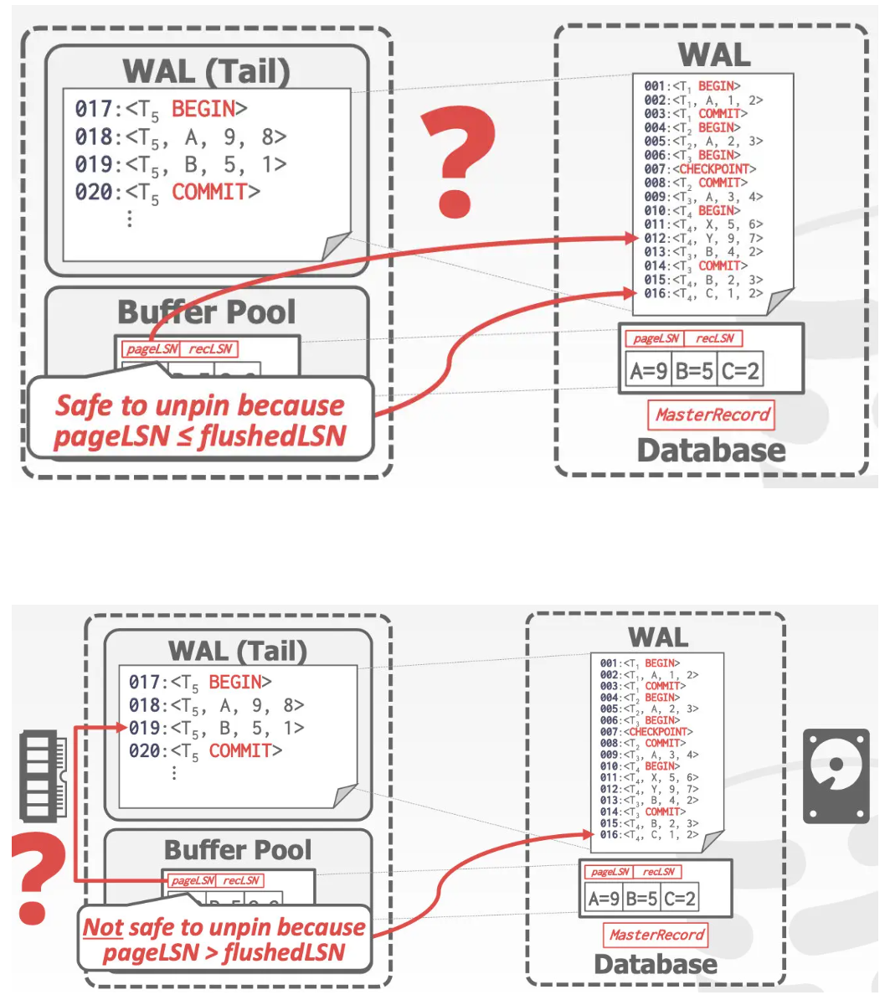

- ARISE算法 数据库恢复 原型算法
	- WAL支撑
		- 日志先于数据落盘
		- Steal + No-Force的缓存池管理策略
	- Redo过程是复现历史操作
		- 按照日志记录的内容做回放，恢复到故障发生前的状态
	- Duno过程是记录变更
		- 在 undo 过程中记录 undo 操作到日志中，确保在恢复期间再次出现故障时不会执行多次相同的 undo 操作
- LSN 日志序列号 Log Sequence Numbers
  collapsed:: true
	- WAL中的每条日志记录都需要包含一个全局唯一且一般是单调递增的ID
	- DBMS中的不同部分都需要记录某些相关的LSN信息(不同种类的LSN)
		- |Name|Where|Definition|
		  |flushedLSN|内存|最后落盘的那个 LSN|
		  |pageLSN|page_x|该页page_x的最新修改|
		  |recLSN|page_x|上一次页page_x被flush后的第一个修改|
		  |lastLSN|事务T_i|事务T_i留下的最后一条日志|
		  |MasterRecord|磁盘|上一次打checkpoint点对应的地方|
	- 脏页Flush有关的LSN
		- 被刷新的page都包含pageLSN
		- DBMS会持续追踪flushedLSN
		- 在page_x写入磁盘前，我们必须确保刷入的日志记录至少满足如下条件 `pageLSN_x <= flushedLSN`
			- 比flushedLSN小的pageLSN记录都应该刷入磁盘
			- {:height 415, :width 361}
		- 所有的日志记录都有LSN
		- 一旦事务修改了page中的记录，就要更新相应的pageLSN
		- 每次DBMS将WAL缓冲区写入磁盘，就更新在内存中的flushedLSN
- 事务的提交&回滚操作
	- 前提假设
		- 所有的日志记录都在一个page里面
		- 写入磁盘的操作是原子性的
		- 记录tuples使用的是严格的2PL模式
		- buffer manager使用的是Steal +No-force模式
	- Transaction Commit 事务提交
		- 向日志中写入一条`COMMIT`记录
		-