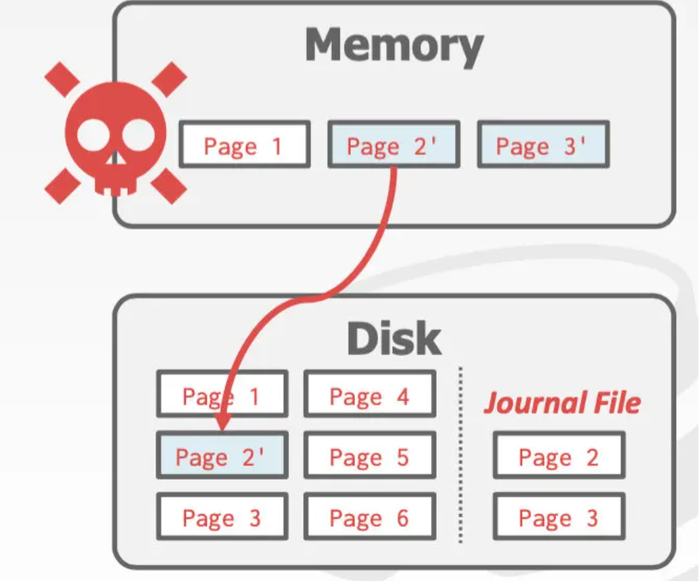
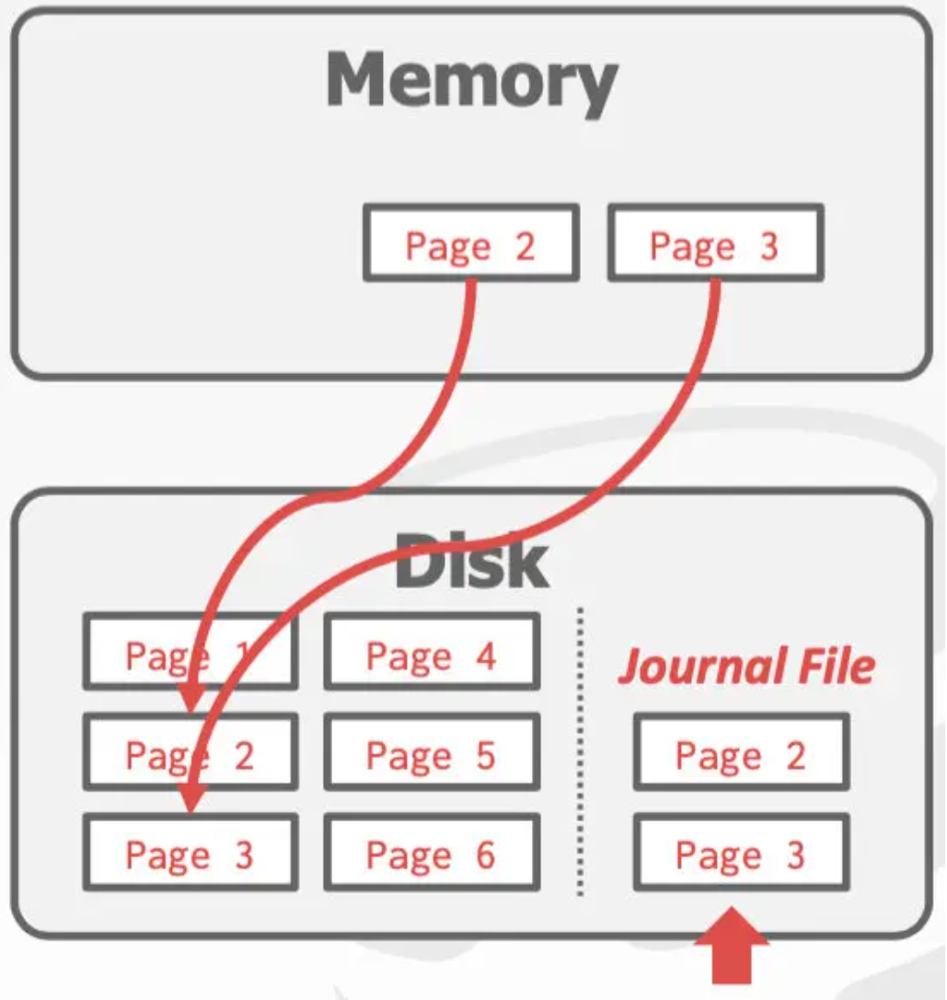

- 恢复算法是一种技术，用来在失败时，确保数据库的一致性、事务的原子性和持久性
- 恢复算法分为两大部分：
	- 发生在事务期间的，用以确保DBMS可从失败中复原。
	- 发生在故障之后进行恢复，确保数据库的状态符合原子性、一致性和持久性
- 故障的级别 Failure Classification
	- DBMS的不同组件依赖于不同的存储设备，而存储设备有如下三类
		- Volatile Storage
		  id:: 6677cbc2-3735-440f-9761-22627c566d33
			- 当断电或程序退出后，数据不会留存
			- 如：各种内存、DRAM、SRAM
		- Non-volatile Storage
		  id:: 6677cbcc-b335-4e44-b96b-ac0c9cac7ffd
			- 当断电或程序退出后，数据依旧存在
			- 如：各种硬盘 HDD、SDD
		- Stable Storage
		  id:: 6677cbd5-d9f5-4713-8a83-a8074fdd8f30
			- 永远不会坏的Non-volatile Storage
- DBMS中的故障分为三级
	- 事务级别的故障 Transaction Failures
		- 逻辑错误 Logical Errors
			- 由于一些程序允许的错误原因，导致事务无法完成
			- 如：用户要求回滚或者OCC的校验阶段发现不可串行而被迫回滚
		- 内部状态错误 Internal State Errors
			- 由于某个错误条件，DBMS必须中止并且重新执行transaction
			- 如：两个事务之间构成死锁，不得不把其中一个回滚
	- 系统级别的故障 System Failures
		- 软件异常 Software Failures
			- DBMS或者OS的bug
		- 硬件异常 Hardware Failures
			- 运行DBMS的机器崩溃了。如：断电
			- Fail-stop假说： ((6677cbcc-b335-4e44-b96b-ac0c9cac7ffd))   硬盘引起的故障不包括在系统故障中。
	- 存储媒介的故障 Storage Media Failures
		- 这类故障一般是无法修复的，数据库开发者无需考虑这些
- Undo/Redo 操作
  id:: 6677ce7d-06d2-4e70-bd88-53668c32cf45
	- Undo: 移除未完成或者abort 事务的影响。
	- Redo：恢复已commit事务，保证其持久性。
	- DBMS如何支持这两个操作，取决于她如何管理缓存池buffer pool
- DBMS要求**事务在commit的时候必须把它所做的更新写入磁盘**,是为Force策略；否则，是No-Force策略
- No-Steal+Force策略
	- 定义
		- {:height 249, :width 478}
		- No-Steal：修改时都会copy一份
		- Force:commit时必须把修改写入磁盘
	- 优点
	  collapsed:: true
		- 回滚时不需要做undo操作，只需把缓存池改回到原来的状态即可
			- 被回滚的事务所做的更新没有被其他已经提交了的事务所连带着写入硬盘
		- 重启恢复的时候也不需要做redo操作
			- 因为事务commit的时候就已经完成了持久化
	- 缺点
	  collapsed:: true
		- 刷盘操作过于频繁，性能不佳
		- 每个事务可修改的数据的量严重受缓存池大小限制
			- 如果有一部分被修改过的页提前被踢出缓存池，那么就破坏了事务的原子性。特别是全表扫描然后更新的这种场景下。
	- 具体实现
		- ((6677d2e6-0f7d-498d-91dc-7046cf0e2a5c))
- Steal+No-Force策略
	- ((6677d4d0-52bd-4ebb-87bf-4011ba257a26))
-
- Shadow Paging
  id:: 6677d2e6-0f7d-498d-91dc-7046cf0e2a5c
	- 会维护两份数据库数据
		- Master：包含所有已经提交事务的数据
		- Shadow：在 Master 之上增加未提交事务的数据变动
	- 正在执行的事务都只将修改的数据写到 shadow copy 中，当事务提交时，再原子地把 shadow copy 修改成新的 master。
		- 为了提高效率，DBMS 不会复制整个数据库，只需要复制有变动的部分即可。
		- {:height 251, :width 415}
	- 优点
		- 新的shadow page在Tx1执行的过程中可以被刷到磁盘中，因为会刷到磁盘里新分配的页，其他事务看不到这些页，直到Tx1提交之后。
		- 因为这个特性，能容纳修改的大小远远超过了buffer pool
	- 缺点
		- 磁盘I/O次数增多，因为在事务进行的过程中就要往磁盘里写数据。
		- 一个shadow page里面可能有成百上千条的数据（MySql 1页=16KB）如果我们只修改数据库文件某个页里的一条数据的话，那么还是要对这整个页做一个拷贝，因此就会有很大的冗余，拷贝的开销不小。
		- 在commit时所做的事情太多
			- 把shadow page都刷入磁盘
			- 修改DB Root
			- 对之前的内存和磁盘里的旧的页做垃圾清理.
		- 容易造成数据的碎片化
			- 清理掉了很多旧页之后，磁盘上出现了外部碎片/空穴（如下所示），数据的存储可能就因此变得不连续
	- SQLite 曾经使用过改进后的Shadow Paging策略
	  collapsed:: true
		- {:height 469, :width 456}
		- 硬盘上journal file里存储的是事务要修改的页的原始版本，commit时会把缓存池里修改后的页刷入磁盘里对应的地方（非jouranl file区）
		- {:height 288, :width 337}
		- 如果刷入Page 2'之后停电了，机器重启后会把journal file加载入缓存，然后把它写入磁盘，这就完成了对断电时未提交的事务的回滚，保证了事务的原子性
		- {:height 324, :width 291}
		- {:height 330, :width 301}
		-
- Write-Ahead Log WAL 预写日志
  id:: 6677d4d0-52bd-4ebb-87bf-4011ba257a26
	- 磁盘中会单独开辟一块区域log File，用于保存事务对于数据的修改操作。
		- 假设日志文件存储在不容易损坏的存储设备上 ((6677cbd5-d9f5-4713-8a83-a8074fdd8f30))
		- 日志中包含足够多的信息来完成  ((6677ce7d-06d2-4e70-bd88-53668c32cf45))
	- DBMS必须先完成预写日志的持久化，再完成缓存池里dirty page的持久化
	- WAL 协议
		- DBMS将所有的事务日志存放在 ((6677cbc2-3735-440f-9761-22627c566d33)) 中，通常是内存中的一段专用空间。
		- 在将数据页落盘前，所有的日志记录必须先落盘
		- 直到所有的日志记录都被写入 ((6677cbd5-d9f5-4713-8a83-a8074fdd8f30)),事务Tx1才被认为是commit完成。
		- 事务开始时会写入一条`<BEGIN>` 记录
		- 事务结束时，会写入一条`<COMMIT>`记录
		- 同时，确保所有的日志记录都写入成功，才会把“提交成功”的消息返回给上层app
		- 每一条entry包含如下内容：
			- 事务ID
			- 被修改的对象ID
			- 修改之前的值(Undo操作使用)
			- 修改之后的值(Redo操作使用)
		- MySQL的WAL分为undo Log 和Redo Log两部分存储
			- 好处之一是可以把undo Log拿去做增量存储，实现MVCC
	- 何时将脏数据落盘？与缓冲池的策略有关
		- 
		- 由于Recovery发生的频率很低，开发者们更多的是选择no-force + steal的策略来保证运行时的速度。
- Logging Schemes 日志的Schema
	- 物理日志：记录每一个页具体到二进制的变化
	  collapsed:: true
		- 如果事务所执行的操作是对很多很多的数据进行修改（比如说修改全表的某个attribute的值），那么物理日志将会非常庞大
	- 逻辑日志：记录事务所执行的操作
	  collapsed:: true
		- 如果只采用逻辑日志，在redo重放日志的时候可能会重放出来错误的结果，或者说是出现逻辑问题。
			- 如果事务执行了“记录数据库当前的时间”这样的SQL指令（可能会通过SQL的`now`函数来实现），在redo的时候就会出现问题
			- 如果SQL语句当中含有`limit`，这是不会保证每次执行时吐出的数据集都一样的
		- 在事务并发执行的情况下，逻辑日志很难实现一致的事务并发控制
	- 混合模式 phsilogical logging
		- 记录的是某个页的第几号槽（slot）指向的tuple内的数据的变化
			- 不会受存储引擎整理数据页中的tuple时造成的影响
		- 还是没有彻底解决“访问的数据过多导致日志过于庞大”的问题
		- 在redo/回放时会多一些开销
		  collapsed:: true
			- 需要根据slot号推断出具体的偏移量是多少
			- 逻辑计划在redo的时候开销最大，因为需要把SQL语句经过查询优化器重新执行
	- 
	-
- Checkpoint机制
	- WAL不可能无限的增长下去
	- 当崩溃发生后，DBMS需要重放replay整个日志，将会耗时严重
	- 有了存档点之后，可以把存档点之前的日志都删掉，并且崩溃恢复的时候，只需要回放存档点之后的日志即可
	- DBMS会定期地把全部的脏页和日志都被写入磁盘，然后(定期的)在日志中打上checkpoint。
		- 这意味着，在checkpoint之前就提交了的事务T1不用管,T2需要redo，T3需要undo
		- 
		-
	- 存在的问题
		- 在制作checkpoint时，DBMS必须停止所有的事务活动，来确保一致性的副本
		- 扫描整个日志来寻找那些未提交的事务很耗时
		- DBMS制作chekcpoint的频率不好评估
			-