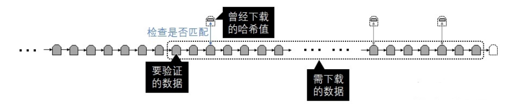

- 简介
	- 当今互联网交易,完全依赖于金融机构作为可信的第三方来处理交易内容.如 支付宝,微信支付.基于该信任模型,会产生如下缺点
		- 1. 金融机构的仲裁成本,增加了交易成本,限制了最小实际交易额度. 信用成本上升
		  2. 为了防范欺诈,商家必须更加警惕他们的客户,希望搜集更多的非必要信息. 过度信息收集,泄露风险.
	- 本论文旨在创建一个不需要可信任第三方的交易系统,基于密码学原理,使用程序化合约的方式,保证交易在计算上的不可撤销.
- 交易 & 时间戳
	- 数字签名
		- 数据经过 [[哈希函数]] 所算出来的一串字符串.即使数据内容只被改动一个字母,得出的哈希结果依旧相差甚远.
		- 例如,A向B借款1千元,并打下借条 `5月1日,A向B借款 一千元 整,约定10月1日归还`. 那么可以生成一串数字签名,A和B各一份.待到归还时,A需要验证B对借条内容有无篡改,则只需要再次加密一遍,拿着结果与手中的数字签名比对即可.
	- 数字签名链
		- 将链条中,`前一节点的哈希值+当前节点的数据+ 交易发生时间` 一起计算. 这样就能把所有数据串成一串.按交易发生时间排序.
		- 随着时间的推移,链条越来越长.前一节点的可信度也就越来越高.因为伪造的成本会更大.
		- 这样做的好处是,在对方没有保存初始哈希的情况下,让对方相信数据没有被篡改
		- 例如,需要让陌生人C相信A与B的借款协议没有被篡改.那么,需要如下步骤
			- 1. 前提条件,C不知道借款协议的原始数据,也不知道原始哈希值.而该协议是存在H链上的一个节点H_a
			  2. 但是,C会定期拉去H链上的最新节点H_max,保存在本地.他的所有本地副本集合,称为H_t
			  3. 那么,C可以 比较自己的集合H_t 与H链上对于的节点,没有被窜改 -> H链没有被窜改 -> H_a没有被窜改
			- 
- 区块
	- 将哈希链条按照时间进行分割(eg. 10分钟一段),每一段就称之为一个区块.一个区块含有不等的交易数据.
	- 注意,我们是**多节点**的**分布式**系统,将链条分割成多段,每一段以其中一个节点为准.这样,用户在上传数据时,并不会 由于网络延迟原因,**生成不同顺序的数据链条**.
	- 到底哪一个节点说了算?
		- 哪一个节点率先拿到了某一段的"话语权",就是该节点说了算.
		- 在BTC中,则是 率先计算出符合条件的新区块的节点 说了算.对应后文的 工作量证明 和 共识机制
	- 为什么以时间为划分依据?
		- 如果按数据长度来划分,随着数量的增大,每段生成的时间需要越来越短,短到 几毫秒,几微秒.远低于信息传播时间,无法响应过来.
- 工作量证明
	- 定义
		- 在做一件主要的事情A之前,先做一件事情b.自己必须付出一定的成本,以此向外传递一个 自己是可以信任的 信号.
		- 它传递的是一种信号,旨在提升 资源转换为信任的效率.
		- 关键点
			- 1. 事情b不能太重,但一定要占用(消耗)一定的资源.
			  2. 大量的做事情b会**付出高额的成本**
		- 对于我们的H链来讲,**改变区块H_a需要重做所有后面的区块**,成本将异常的高昂.
		- 在BTC中,工作量证明的手段是 找到一个哈希结果是前n位为0的值.
	- 工作量的难度
		- 随着科技的发展和市场的逐渐完备,投入到H链中的总算力是不断增长的.当计算出一个区块的难度不变时,产生新区块的频率会上升.
		- 频率上升,意味着 投入计算节点的平均成本会下降.也意味着做坏事的成本下降了.
		- 同时,频率上升,意味着 每个区块所记录的数据量变少了.
		- 在BTC中,采用 移动平均数法,来对生成区块的难度进行动态调整
			- `新难度值 = 旧难度值 * (过去x个区块总时长/y小时)`
- 网络 & 共识机制
	-
	-