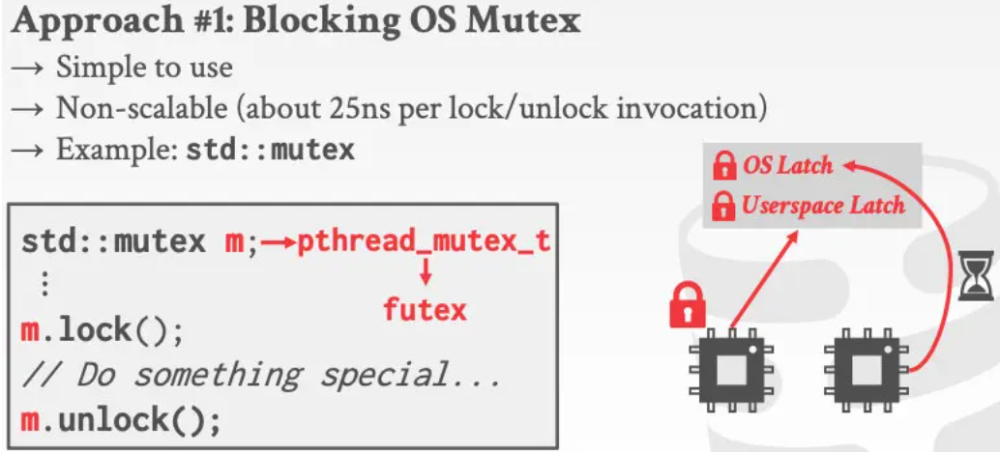

- Physical Correctness
	- 多线程共享的对象在被并发访问时，其内部的数据结构能够保存稳定
- DB世界中，Lock VS. Latch
	- Lock
		- 逻辑上的宏观锁，如：锁上表中的某一行数据，通常伴随*事务*出现
		- 在整个事务期间生效
		- 随时可回滚
	- Latch
		- 内部的具体数据结构，如B+树的某一节点
		- 在整个具体的操作期间生效
		- 无需考虑回滚问题
- Latch的三种实现方式
	- Blocking OS Mutex 系统层级的阻塞式互斥锁
		- 
		- 得不到锁的线程会进入`sleep`状态，等待持有锁的线程释放锁并唤醒。
		- 加锁/释放锁操作，会进入内核态，无法应对大规模并发。
	- TAS(Test-and-set) Spin Latch 自旋锁
		- 
		- 用法简单
		- 无法因对大规模并发
		- 对缓存和OS不友好(占用CPU)
	- Read-Write Latch 读写锁
		- 允许多个reader
		- 内部有读写等待队列(有界)，避免等太久
		- 底层是基于自旋锁实现的
- Hash表的并发控制
	- 任何一个线程都在Hash数组中从上往下查找，不会发生死锁
	- 当Hash表调整大小时，会施加全局锁。
	- 当不调整大小时，可以加局部锁。
		- page粒度--给磁盘页 加锁
		- slot粒度-- 给Hash Slot 加锁
	- 不加锁的方案：读写分离+插入空slot时使用cas
- B+树的并发控制
	-