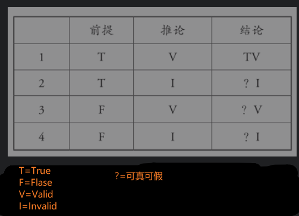

- 逻辑与经验 -- 真假与对错
	- 经验语句
		- 描述一种具体现象或事物的语句，它本质上还是语句，属于逻辑范畴
		- 如 '一个茶杯在桌子上'
		- 在事物层面，只有有无(**对错**)，而无真假；只有到了语言层面，才发生**真假**问题
			- 在发表议论时，通常有人会说’你说的不对‘，’这句话不对‘ 这里的不对，应该表示的是假。
	- 语句
		- 既有真假，又有对错。
	- 推论形式 #推论
		- 将语句中的具象名词替换成抽象名词x,y,z等表示一切的代号，从而展现出来的一种特殊句式。
		- 决定逻辑的**推论形式**是否有效，靠逻辑规律来保证
		- 它是一种现象，形容它用到的是**对错**
	- 真假与对错的44种可能 --排列组合
		- 
		- 名词解释
collapsed:: true
			- 前提
				- 所有在结论之前的话语
			- 推论  #推论
				- 通过一组数据而抽象概括出来的特定模型 或 句式
				- 位于前提与结论之间
			- 结论
				- 由前提经由推论演绎出来的结果
	-
	-
	-