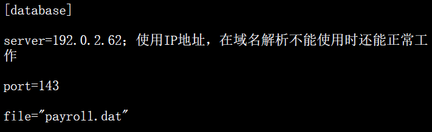

- 以windows为首的c,c++语言,使用的是以`.ini`结尾的配置文件.由 节 配置信息和注释组成
	- 节 形如 `[section]`
		- 用于对配置信息进行分类.每一个节中可以有多个配置信息
	- 配置信息 形如`entry=value`
		- value包含两种类型:数字或字符串
	- 注释 形如 `;这是一个注释,可以写在任意位置`
		- 注释以英文分号开始,到该行末尾结束.
	- 
- 在[[Java]]中,有 `java.util.Properties` 类,用于处理简单的配置文件
	- Properties并不能对配置进行分类
	- 只能读取简单的`entry=value`格式的配置
	- 通常写在一个[[xml]]文件当中
- Java社区提供了对Properties的功能扩展,最常用的[[第三方Jar包]]是 Apache Jakarta Commons的Commons Configuration