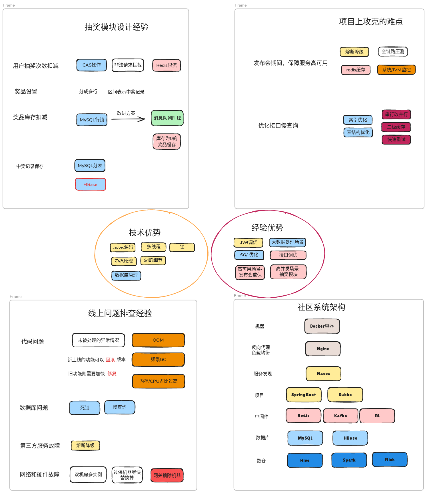

- 面试之前，熟练背诵下面四问及其衍生知识点
	- https://excalidraw.com/#json=H2VHXEhXLI3PZsSlhBhPo,M_mBAowOixMbhhmEWi3Z9Q
	- 
- [[Spring框架面试题]]
- [[Java项目介绍面试题]]
- [[Java 模块设计要略]]
- [[Dubbo面试题]]
- [[Java 源码面试题]]
- 关于技术广度和深度的思考
	- 广度 -> 高并发、高可用 -> 复杂问题的分析能力和解决能力 -> 机会多
	- 深度 -> db、RPC和常用工具的原理 -> 避坑和专业能力 -> 要价高
- 抽奖模块衍生问题 #card
  card-last-interval:: 0.14
  card-repeats:: 1
  card-ease-factor:: 2.36
  card-next-schedule:: 2024-08-23T04:49:14.475Z
  card-last-reviewed:: 2024-08-23T01:49:14.475Z
  card-last-score:: 3
	- ((66544683-599a-453a-86db-0981a27e96a2))
	- ((66544683-3ee1-4592-aef0-872d932adf0d))
	- ((66544683-cc32-4b28-9fbb-dd51a00cf780))
	- ((66544683-689f-49c0-b896-a44dfc456883))
	- ((66544682-bdee-4d8c-bf84-15f2624311e0))
	- ((669f0d56-9b74-4b45-a032-989c4137ad4c))
	- 针对库存扣减，还有什么改进方案吗？
	  collapsed:: true
		- 异步MQ，削峰
		- 库存为0的商品缓存
	- ((66544682-0e06-4a44-b423-789a8907f544))
	- ((66544683-0dee-42cf-a424-b153657716bd))
- 发布会重保衍生问题 #card
	- ((66544683-eccc-4a35-a207-6405a40f7b49))
	- ((66544683-54e6-404a-b2a4-a1b75a3296cc))
	- ((66544683-d1df-4dae-8535-c0706bccdc63))
	- ((66c2f8d9-c8db-4175-a464-5aa9af3bc3c4))
	- 熔断降级是怎么实现的
		- {{cloze 后台配置}}
		- {{cloze Hystrix}} or {{cloze Sentinel}}
		- 两者的优缺点
			- H 没有 {{cloze 监控平台}}
			- H 支持的 {{cloze 维度}} 较少，不够细粒度
			- S 支持 {{cloze 限流}} 和 {{cloze 降级}}
			- S 具有完善的 {{cloze 监控和后台}}
	- 压力测试时关注哪些指标
		- 响应时间
		- 吞吐量/并发量
		- 错误率
		- 机器资源指标 CPU、内存、磁盘IO
	- 链路追踪的基本原理
		- {{cloze Trace}} - 链路ID
		- {{cloze Span}} - 每一次的服务调用
		- {{cloze Anntoation}} - 服务调用时附加的日志信息
		- 运作方式- {{cloze Java Agent }} + {{cloze 字节码注入}} 、 {{cloze 抽样}} 采集
- 慢接口优化衍生问题/压力测试中，如何进行调优 #card
  id:: 66c2b060-3a67-461b-8d2a-20d37692f3d8
	- {{cloze 缓存+过期时间}}
	- {{cloze 多线程+任务编排}}
	- 线程池，包括 {{cloze 数据库链接池}} 和 {{cloze http请求池}}
	- 单次请求的 {{cloze 最大等待时间}} 和 {{cloze 重试次数}} ， 快速失败重试
	- {{cloze 索引和表结构的}} 优化
	- JVM调优
- 线上问题排查经验 #card
	- ((66c2b37c-4e6f-47dc-a816-6830524773f1))
	- ((66c2b383-718f-4bc1-9945-e5973dcf23dd))
	- ((66544681-7486-43a2-832f-a98d2314a5a4))
	- ((66bdbe38-595c-4b97-acf6-d42aa64126fc))
	- G1  ((66ac8e7e-410e-4616-bb66-5e83251ca1d8))
	- ((66bdbc9d-7b97-4067-bbcd-79118beecc58))
	- ((66b2c808-ec8f-41cc-85b4-9e91f056ce7c))
	- ((66c2b8a3-dbe4-432d-92d9-e1b138d9ee50))
	- ((669f0d56-9b74-4b45-a032-989c4137ad4c))
	- ((66544682-3ef3-48a1-8016-f7c29dd8c85d))
	- ((66544682-8b5a-4888-9bd0-2104beb329f7))
	- ((66544682-c74c-4d87-b12d-00a4d0f39d87))
	- ((669f1220-37aa-4091-a51e-76a66e191b29))
- 核心技术优势 #card
  card-last-interval:: 0.14
  card-repeats:: 1
  card-ease-factor:: 2.36
  card-next-schedule:: 2024-08-23T05:06:10.387Z
  card-last-reviewed:: 2024-08-23T02:06:10.387Z
  card-last-score:: 3
	- ((66b1bef3-8dcd-4de9-bf66-9e8e321e1f1c))
	- ((66544682-588e-464b-9362-54ece80391ca))
	- ((66544682-54b6-40a8-b0be-a8595a5d199b))
	- ((66544682-9c55-4747-8b61-7a3bca8924d9))
	- ((66b195b5-0b07-4b75-91af-088d7e445523))
	- ((66b20b36-7c48-424a-9b27-a2c18f1e2a9a))
- 核心经验优势 #card
  card-last-interval:: 0.14
  card-repeats:: 1
  card-ease-factor:: 2.36
  card-next-schedule:: 2024-08-23T05:07:59.234Z
  card-last-reviewed:: 2024-08-23T02:07:59.234Z
  card-last-score:: 3
	- ((66544681-b7e8-492b-b50b-84d4270751e8))
	- ((66bdbe38-595c-4b97-acf6-d42aa64126fc))
	- ((66c2b060-3a67-461b-8d2a-20d37692f3d8))
	- ((66544682-4d24-4646-8ba6-527ef3a72f1d))
	- ((66c2e7b0-6752-45f9-89fa-11fe7162bbf7))
	- ((66c2e98d-7825-4f7b-8e37-2ae2f7605cdc))
- 令人印象深刻的异常排查 #card
  card-last-interval:: 0.14
  card-repeats:: 1
  card-ease-factor:: 2.36
  card-next-schedule:: 2024-08-23T05:00:52.554Z
  card-last-reviewed:: 2024-08-23T02:00:52.554Z
  card-last-score:: 3
	- ThreadLocal + 线程池引起的 内存泄露
		- 手动释放
	- 用户签到记录查询，userId因为数据类型不一致而引起的 索引失效
		- 代码中注意转换类型
	- 抽奖接口，int类型是值传递，方法内修改后不会传出方法外，导致 数据库的中奖记录与用户页面展示的不一致
		- 改用无副作用的 return模式
	- spring的事务失效
		- 情景1, 直接调用方法a而没有走代理类
		- 事物方法a中启用多线程，未传递事务参数进去
- 待归档面试题 #card
  card-last-interval:: 0
  card-repeats:: 11
  card-ease-factor:: 1.3
  card-next-schedule:: 2024-08-14T01:28:25.564Z
  card-last-reviewed:: 2024-08-14T01:28:25.564Z
  card-last-score:: 3
  collapsed:: true
	- 线程池中的线程回收过程
		- {{cloze 上锁 先count-- 后移除worker}}
	- for update 原理
		- {{cloze 锁住的是索引，并非记录}}
	- MySql 查询结果缓存(Buffer Pool)的淘汰策略
		- 结构是 {{cloze 链表}}
		- {{cloze LUR算法}}
	- MQ如何实现延时队列
		- {{cloze 消息过期+死信队列}}
- 小米社区如何做到的高并发、高可用、高性能？#card
  card-last-interval:: 0.01
  card-repeats:: 6
  card-ease-factor:: 1.3
  card-next-schedule:: 2024-08-14T01:31:30.756Z
  card-last-reviewed:: 2024-08-14T01:31:30.756Z
  card-last-score:: 3
  collapsed:: true
	- 高性能-慢接口的优化
		- {{cloze CompletableFuture 异步任务编排}}
		- {{cloze redis缓存}}
		- {{cloze MySQL慢查询优化及分表}}
	- 高可用
		- {{cloze 限流}}
		- {{cloze 降级}}
	- 高并发
		- {{cloze 分布式锁}}
		- {{cloze 本地缓存+redis缓存}}
		- {{cloze 热点数据分散}}
		- {{cloze CAS无锁操作}}
- Java在抛出OOM时，程序有没有停止运行？这是为什么
  card-last-score:: 3
  card-repeats:: 5
  card-next-schedule:: 2024-08-22T20:20:52.000Z
  card-last-interval:: 10.51
  card-ease-factor:: 1.38
  card-last-reviewed:: 2024-08-12T08:20:52.000Z
	- 会停止运行。因为程序需要内存才能继续执行，而一旦没有足够的内存，程序就无法继续执行下去。
- OOM异常可以捕获吗？有什么方法能对他进行感知
  card-last-score:: 3
  card-repeats:: 5
  card-next-schedule:: 2024-08-22T20:20:55.801Z
  card-last-interval:: 10.51
  card-ease-factor:: 1.38
  card-last-reviewed:: 2024-08-12T08:20:55.801Z
	- 当OOM发生时，可以打印堆栈文件(dump文件)
	- 使用VisualVM 等监控工具，监控内存使用情况
- Java程序在启动时，配置的内存空间为16M，在Linux视角下，它的内存占用是16M+吗？为什么？ #card
  card-last-interval:: 11.02
  card-repeats:: 4
  card-ease-factor:: 1.66
  card-next-schedule:: 2024-08-18T02:16:26.767Z
  card-last-reviewed:: 2024-08-07T02:16:26.768Z
  card-last-score:: 3
	- 配置的内存空间为16M，通常是指Java虚拟机（JVM）的堆内存大小为16M，而**程序本身可能还需要占用其它内存空间**，例如JVM线程栈、Java类加载器、Java虚拟机本身使用的内存等。
- 什么情况下，我更新一行MySQL数据，比如说我更新id=8的数据，会锁住 id = 6,7,8三条记录？
  card-last-score:: 3
  card-repeats:: 4
  card-next-schedule:: 2024-08-18T02:14:21.662Z
  card-last-interval:: 11.02
  card-ease-factor:: 1.66
  card-last-reviewed:: 2024-08-07T02:14:21.663Z
	- 事务查询级别为RR和串行化，会锁住当前事务中查询到的所有数据
	- 更新时使用了索引，可能会锁住索引覆盖的所有行
	- 使用了外键约束，当更新主表的记录时，会锁住所有关联从表中相应的记录
	-
- 给出一段code，它的每一步的print输出是什么 #card
  card-last-interval:: 11.02
  card-repeats:: 4
  card-ease-factor:: 1.66
  card-next-schedule:: 2024-08-18T02:16:45.983Z
  card-last-reviewed:: 2024-08-07T02:16:45.983Z
  card-last-score:: 3
  collapsed:: true
	- ```
	  import java.util.Arrays;
	  import java.util.List;
	  import java.util.HashSet;
	  
	  public class Main {
	      public static void main(String[] args) {
	          HashSet set = new HashSet();
	          Person p1 = new Person(1001, "AA");
	          Person p2 = new Person(1002, "BB");
	          set.add(p1);
	          set.add(p2);
	          System.out.println(set);    //(1001, AA), (1002, BB)
	  	
	          p1.setName("CC"); 
	          set.remove(p1);
	          System.out.println(set); //  (1001, CC), (1002, BB)
	  	
	          set.add(new Person(1001, "CC"));
	          System.out.println(set); // (1001,CC),(1001,CC),(1002,BB)
	  
	          set.add(new Person(1001, "AA"));
	          System.out.println(set); // (1001,"AA"),(1001,"CC"),(1001,"CC"),(1002,BB)
	      }
	  }
	  
	  class Person {
	      private int id;
	      private String name;
	  
	      public Person(int id, String name) {
	          this.id = id;
	          this.name = name;
	      }
	  
	      public void setId(int id) {
	          this.id = id;
	      }
	  
	      public void setName(String name) {
	          this.name = name;
	      }
	  
	      @Override
	      public boolean equals(Object o) {
	          if (this == o) return true;
	          if (!(o instanceof Person)) return false;
	  
	          Person person = (Person) o;
	  
	          if (id != person.id) return false;
	          return name != null ? name.equals(person.name) : person.name == null;
	  
	      }
	  
	      @Override
	      public int hashCode() {
	          int result = id;
	          result = 31 * result + (name != null ? name.hashCode() : 0);
	          return result;
	      }
	  
	      @Override
	      public String toString() {
	          return "Person{" +
	                  "id=" + id +
	                  ", name='" + name + '\'' +
	                  '}';
	      }
	  }
	  ```
		- 本题考查的是Hash Map的源码，问题的关键是 {{cloze 先hash，后equals}}
- 发布会期间-小米社区抗住高QPS经验 #card
  card-last-interval:: 1.63
  card-repeats:: 4
  card-ease-factor:: 2.08
  card-next-schedule:: 2024-08-13T22:28:40.464Z
  card-last-reviewed:: 2024-08-12T07:28:40.464Z
  card-last-score:: 3
  collapsed:: true
	- 战果
		- 瞬时流量峰值达到 27k,且在14K附近维持了近2个小时
	- 手段
		- 流量入口
			- 对活动的关键节点进行研究，可以得知在什么时刻提及社区app的哪些功能。对这些功能页面进行抓包，梳理出**所有**的接口调用。
		- 扩容
			- 根据接口找到代码所在项目，按照以往最高流量+20%的空间为预想峰值，提前1-2个小时进行机器扩容。
		- 缓存
			- 根据以往经验或是用户行为、推算可能产生的热点数据，对其进行2级缓存(本地+redis)
		- 降级
			- 对用户行为链路之外的所有接口，预埋降级开关。必要时开启。
		- 限流
			- 对主要入口，进行流量限制，提示用户等待3-5秒后重试。
		- 监控
			- 根据接口找到代码，再找到涉及的中间件。联系中间件相关运维（redis、MySQL、Nginx、网关），活动期间实施强效监控
			- 必要时运维介入进行链接的熔断操作。
	- 代码走查
		- 这一切行动做完后，全员进行相关代码的code review
		- 如有必要，测试介入进行压力测试
	- 文件归档
		- 各种配置一键直达、各种监控平台一键直达
	- 插曲
		- 索引失效引发的慢查询-导致MySQL报警
			-
- 现在有一个模块A,既能放在用户服务，又能放入财务服务。根据合理的取舍，指明模块A应该放在哪个服务中。#card
  card-last-interval:: 5.82
  card-repeats:: 3
  card-ease-factor:: 2.08
  card-next-schedule:: 2024-08-18T03:16:27.635Z
  card-last-reviewed:: 2024-08-12T08:16:27.676Z
  card-last-score:: 3
  collapsed:: true
	- 数据隔离
	- 服务耦合
		- 有较强的依赖关系或频繁的数据交换
	- 模块A自身的性能，会影响被加入的服务
	- 团队人员专长
- 系统的慢请求应该如何排查 #card
  card-last-interval:: 4
  card-repeats:: 2
  card-ease-factor:: 2.22
  card-next-schedule:: 2024-08-18T01:20:59.793Z
  card-last-reviewed:: 2024-08-14T01:20:59.794Z
  card-last-score:: 3
  collapsed:: true
	- 分析请求路径，了解流经的组件
	- 检查 {{cloze 数据库SQL}} ，是否存在慢查询
	- 检查 {{cloze 日志}} ，特别是错误和告警信息
	- 检查 {{cloze 资源消耗}} ，如 CPU\内存、磁盘
	- 检查 {{cloze 并发处理能力}} ，是否存在串行瓶颈
	- 检查 {{cloze 网络连接}} ，包括延迟和带宽限制
- 什么时候需要*限流*，什么时候需要*熔断* #card
  card-last-interval:: 5.82
  card-repeats:: 3
  card-ease-factor:: 2.08
  card-next-schedule:: 2024-08-28T20:11:26.138Z
  card-last-reviewed:: 2024-08-23T01:11:26.176Z
  card-last-score:: 3
  collapsed:: true
	- 限流是指限制系统的请求流量，防止系统过载。
		- {{cloze 高并发}}
		- 保护 {{cloze 关键资源}}
		- 防止 {{cloze 恶意攻击}}
	- 熔断是在系统出现故障或异常情况下，采取的自我保护机制
		- {{cloze 依赖服务故障}}
		- {{cloze 错误率超过阈值}} ，自动熔断
		- {{cloze 主动停止非关键服务}} ，主动降级